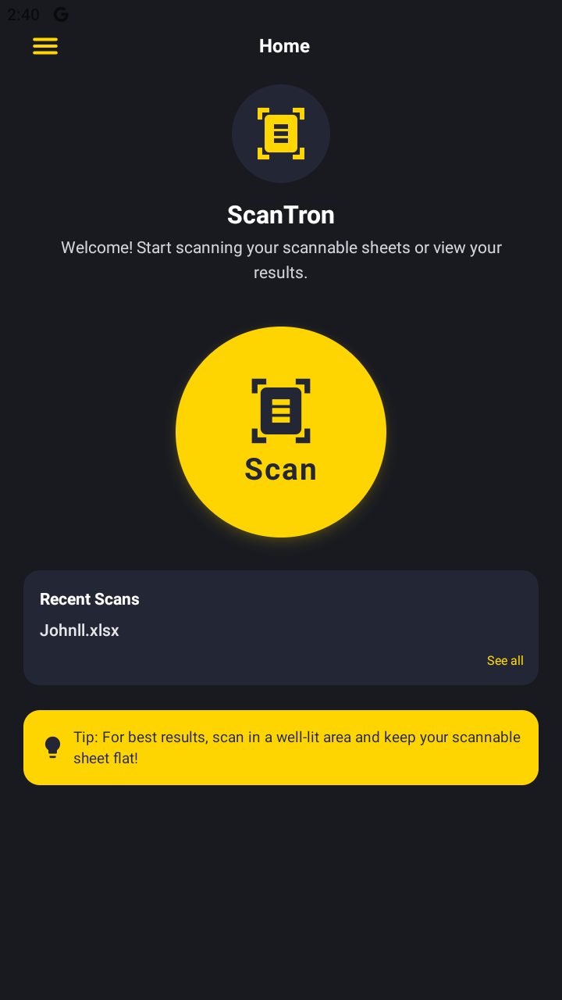

# 📸 Scantron Grading App

An intelligent mobile app built with **React Native (Expo)** that scans and grades multiple-choice bubble sheets using **OpenCV.js**. The app captures a photo of a student's answer sheet, detects marked answers, matches them with the correct answer key, and outputs:

- ✅ Number of correct and wrong answers  
- 🆔 Student index number  
- 📘 Course code  
- 📄 Downloadable Excel report per student  

## 🔍 App Preview

## 🛠️ Tech Stack

- Expo (React Native)
- OpenCV.js
- WebView (local image processing)
- XLSX for Excel export

---

You can also include a short section on how to run the app if you're sharing this with collaborators or recruiters. Let me know if you want that too or if you'd like the screenshot embedded differently (e.g., base64 or via URL).
